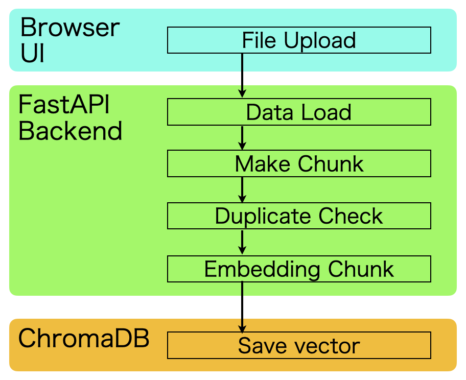
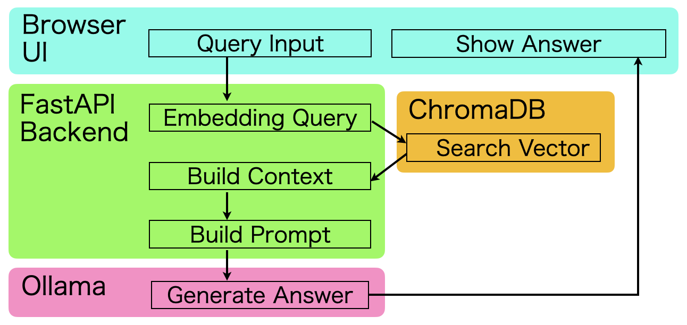
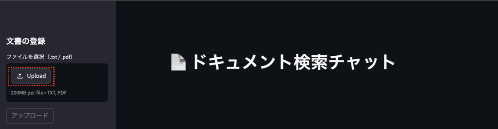
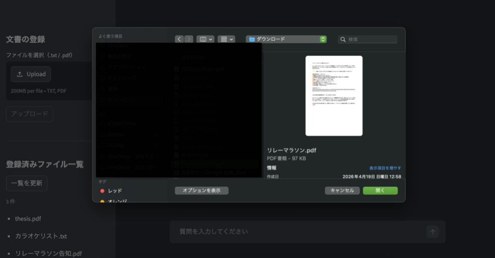
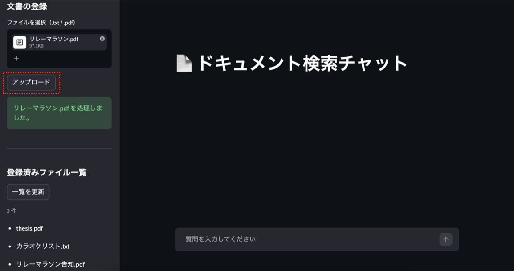
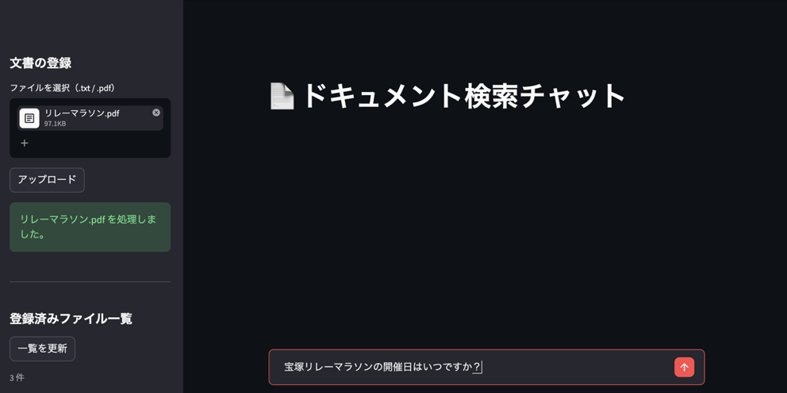
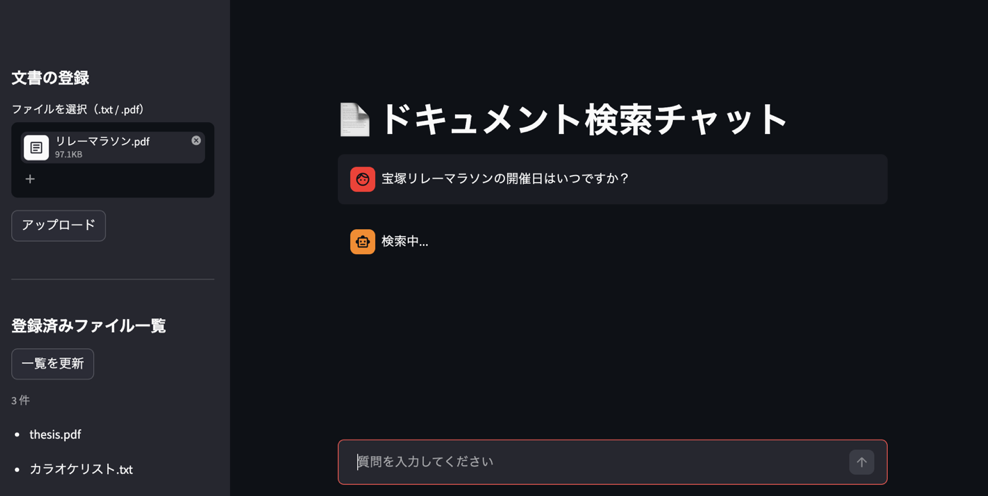
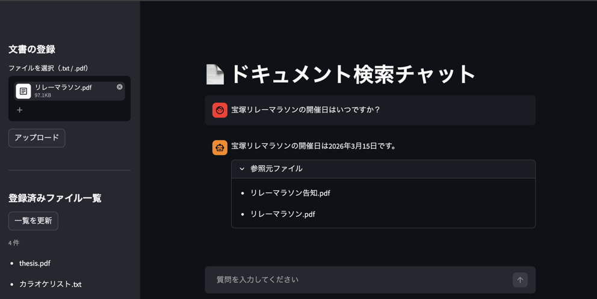

# general-purpose RAG system

> ローカル完結型の汎用 RAG（検索拡張生成）システム


---

## 概要・用途
PDF・TXT ファイルをアップロードするだけで、自然言語でドキュメントへ問い合わせができるシステムです。
外部 API を一切使わず、**すべての処理をローカル環境で完結**させています。
ノートPC での動作を想定した軽量な構成のため、一般的な文章で構成されたドキュメント（社内マニュアル、報告書、議事録、その他ドキュメント）の検索に適しています。
なお、学術論文・法律文書などの専門的なドキュメントには不向きです。そのような用途では、GPU マシンと専用の RAG システムの導入を検討してください。


---

## システム構成

<table>
  <tr>
    <th>ドキュメント登録フロー（ベクトルDB 構築）</th>
    <th>クエリ投入フロー（回答生成）</th>
  </tr>
  <tr>
    <td></td>
    <td></td>
  </tr>
</table>

---

## 主な機能

- **多言語対応** — 日本語・英語・中国語に対応した埋め込みモデル (`intfloat/multilingual-e5`)
- **差分更新** — MD5 ハッシュによる重複検出で既にベクトルDB化されているドキュメントファイルの再処理を回避
- **ストリーミング応答** — LLMの返答のトークン単位によるリアルタイム出力
- **ソース帰属** — 回答に参照元ファイルを表示
- **ローカル完結** — 外部 API 不要、インターネット接続なしで動作

---

## 技術スタック

| カテゴリ | ライブラリ | 用途 |
|----------|-----------|------|
| バックエンド | FastAPI + Uvicorn | REST API サーバー |
| RAG パイプライン | LangChain | ドキュメント処理・LLM 連携 |
| 埋め込み | sentence-transformers | テキストのベクトル化 |
| ベクトルDB | ChromaDB / FAISS | 類似度検索 |
| LLM | Ollama | ローカル LLM 推論 |
| フロントエンド | Streamlit | Web UI |
| ドキュメント処理 | PyPDF | PDF テキスト抽出 |
| テスト | pytest / RAGAS | ユニット・統合・評価テスト |

---

## 必要条件

**Docker を使う場合（推奨）**
- Docker Desktop 24.0+
- Docker Compose v2

**スタンドアロンで動かす場合**
- Python 3.10+
- [Ollama](https://ollama.com/) のインストールと起動

---

## セットアップ

### Docker で起動（推奨）

```bash
# リポジトリをクローン
git clone https://github.com/hyaamann98/general-purpose_RAG.git
cd general-purpose_RAG

# コンテナのビルドと起動
docker compose up --build -d

# LLM モデルをダウンロード（初回のみ）
docker compose exec ollama ollama pull qwen2.5:3b

# API の起動確認
curl http://localhost:8000/health
```

ブラウザで http://localhost:8501 を開くと UI が表示されます。

### スタンドアロンで起動

```bash
# 依存パッケージをインストール
pip install -r requirements.txt

# ドキュメントからベクトルDBを構築
python dataset_maker.py --source local --path ./docs_storage

# CLI でクエリを実行
python query_answer.py --model qwen2.5:3b --k 5
```

---

## GUI操作
### ドキュメント登録フロー（ベクトルDB 構築）
画面左側の「↑Upload」（赤枠内）をクリックする。
  
アップロードするドキュメントファイルを選択する。
  
「アップロード」（赤枠内）をクリックする。
画像の通り、「xxx.pdfを処理しました。」(緑色枠内)と表示されれば、アップロードしたドキュメントファイル内の文章は、
ベクトル化されて、DBに登録されたことになる。
   

### クエリ投入フロー（回答生成）
ページ下部の検索欄に検索内容を記述し、右横の「↑」をクリックする。
  
RAGシステムが検索中は、「検索中...」と表示される。
  
検索が終了すれば、結果が参照元ファイルとともに表示される。


## 設定

環境変数で動作をカスタマイズできます。

| 変数名 | デフォルト値 | 説明 |
|--------|------------|------|
| `LLM_MODEL` | `qwen2.5:1.5b` | 使用する Ollama モデル（Docker環境では `qwen2.5:3b`） |
| `EMBED_MODEL` | `intfloat/multilingual-e5-small` | 埋め込みモデル |
| `CHROMA_DIR` | `./chroma_db` | ChromaDB の保存先 |
| `DOCS_DIR` | `./docs_storage` | ドキュメントの保存先 |
| `API_URL` | `http://localhost:8000` | フロントエンドが参照する API URL |

---

## ディレクトリ構成

```
general-purpose_RAG/
├── src/                  # RAG コアパイプライン
│   ├── api.py            # FastAPI エンドポイント
│   ├── dataload.py       # ドキュメント読み込み
│   ├── make_chunk.py     # テキスト分割
│   ├── embedding.py      # ベクトル埋め込み
│   ├── vector_store.py   # ChromaDB / FAISS
│   ├── retriever.py      # 検索 + LLM 連携
│   └── llm.py            # Ollama ラッパー
├── ui/                   # Streamlit フロントエンド
│   └── app.py
├── tests/                # テストスイート
│   ├── unit/
│   ├── integration/
│   └── evaluation/
├── docs/                 # 設計ドキュメント
├── docs_storage/         # アップロードされたドキュメント
├── chroma_db/            # ベクトルDB（永続化）
├── docker-compose.yml
├── Dockerfile
├── dataset_maker.py      # DB登録用スクリプト（スタンドアロン時）
├── query_answer.py       # クエリ投入用スクリプト（スタンドアロン時）
└── requirements.txt
```

---


## 品質基準（RAGAS による E2E 評価）

以下の閾値を CI の合格条件として設定しています。
実際のスコアはドキュメントの種類・量・LLM モデルによって変動します。

| メトリクス | CI 合格閾値 | 説明 |
|-----------|------------|------|
| Faithfulness | ≥ 0.70 | 回答がコンテキストに忠実か |
| Context Recall | ≥ 0.60 | 必要なコンテキストを取得できているか |
| Answer Relevancy | ≥ 0.70 | 質問に対して回答が関連しているか |

閾値の根拠: `tests/evaluation/evaluate_e2e.py` の `CI_THRESHOLDS` を参照。
